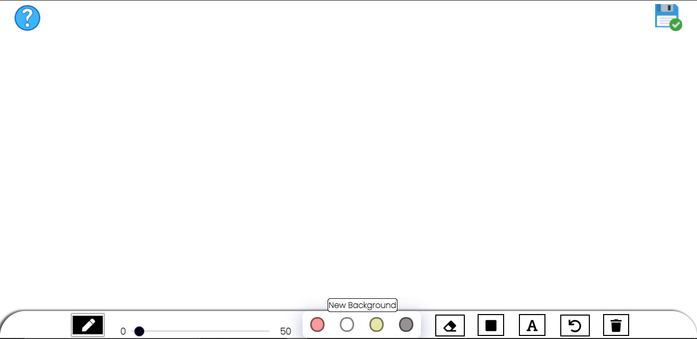
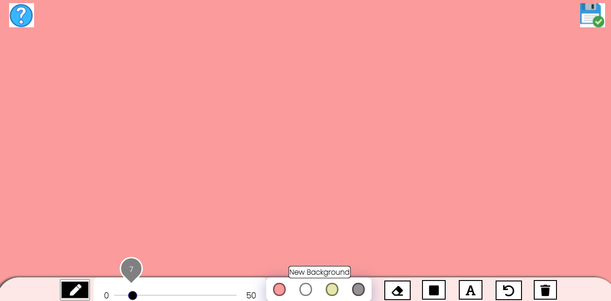
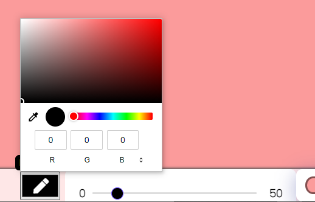
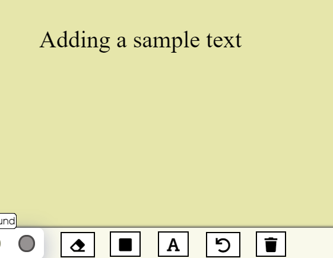
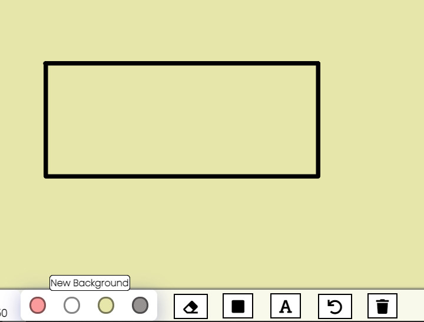
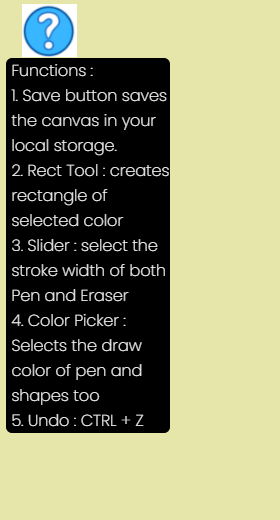

# Whiteboard-app

## A simple whiteboard app where you can draw 🖊 add text 🔠 add shapes ⭕ and also perform actions like erase , clear , undo and save your canvas locally.

---
### This app is an Hackthon Submission in a community server on discord [Devsnest](https://www.devsnest.in/)

### Use it here : [Link](https://thedeepakchaturvedi.github.io/whiteboard-app/WhiteBoard/)

### Features We have added:

- Draw by picking up color of your choice
- Adjust the size of pen and eraser as well as thickness of shapes
- Save your drawing using save button so that refreshing the page does not delete your drawing
- Add text using a text box and place it anywhere
- Add rectangle as a shape from one point to another by dragging
- Erase anything like text, shape, pen strokes
- Undo using the undo button or Ctrl + Z Shortcut
- Use Clear all option to clear everything in one click

---

## ScreenShots of the app:

<h3>Full whiteboard</h3>

<h3>Change Size and Different Board colors</h3>

<h3>Different pen colors</h3>

<h3>Add text</h3>

<h3>Add Reactangle</h3>

<h3>Help button</h3>

---

### Tools and technologies:
1. Canvas in html
2. CSS for icons and all the styling
3. Js for all the logics
4. VS Code as an IDE
5. Live share extension to code together
6. Git-Github to push and pull changes
---

### Learning Outcome:
I learnt how can I:
1. Create all the logics like switch between the tasks on button clicks
2. Canvas and its porperties
3. Save the user data in the local
4. Logics to change colors, erase, undo, change size etc.
5. Add image icons to the cursor and change them on click

---

### Resources we used:
1. Documentations of canvas from [w3schools](https://www.w3schools.com/html/html5_canvas.asp)
2. Video Tutorials from youtube to make whiteboard

---

### How to clone:
1. You may fork this project by clicking `fork` button from the top right corner then it will create the same repository on your github profile
2. It is a two step process
    1. Click on the `Code with down arrow` button in right corner below setting tab.
    2. Then click on download as a zip file to store it to your local store. Extract them and do any changes you like.

